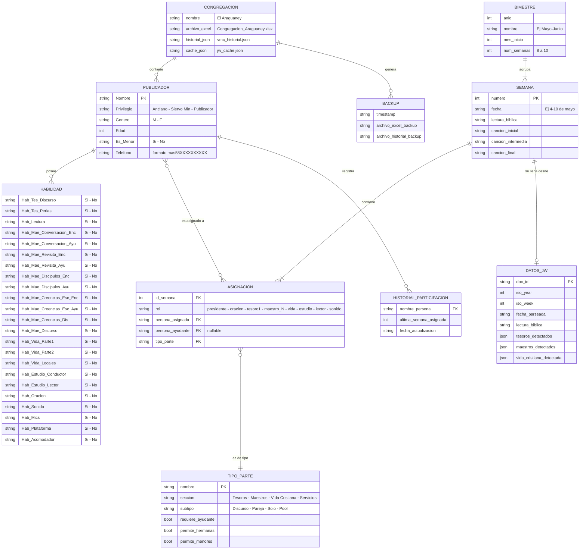
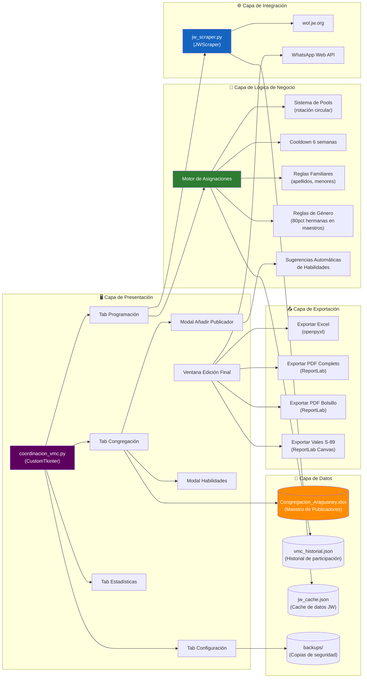

# 📐 Arquitectura del SaaS — Coordinación VMC "El Araguaney"

> [!NOTE]
> Este documento es una radiografía funcional del sistema, generada a partir del análisis del código fuente (`coordinacion_vmc.py` + `jw_scraper.py`). **No se realizó ningún cambio en el código.**

---

## 1. Diagrama de Flujo — Ciclo Operativo Completo

```mermaid
flowchart TD
    START(["🚀 Inicio de Aplicación"]) --> INIT["Inicialización CoordinacionVMC"]
    INIT --> LOAD_EXCEL{"¿Existe Congregacion_Araguaney.xlsx?"}
    
    LOAD_EXCEL -- Sí --> PARSE_DF["Cargar DataFrame con pandas\n- Excluir familias (Spolzino, Saucedo)\n- Migrar columnas legacy\n- Limpiar teléfonos (+58...)"]
    LOAD_EXCEL -- No --> SAMPLE["Crear datos de ejemplo\n(12 varones + 20 hermanas)"]
    SAMPLE --> CLASSIFY
    
    PARSE_DF --> CLASSIFY["Clasificar por rol:\n👴 Ancianos\n📖 Siervos Ministeriales\n👨 Publicadores Varones\n👩 Hermanas"]
    
    CLASSIFY --> LOAD_HIST["Cargar historial\n(vmc_historial.json)"]
    LOAD_HIST --> GUI["Crear Interfaz (4 Tabs)"]
    
    GUI --> TAB1["📅 PROGRAMACIÓN"]
    GUI --> TAB2["👥 CONGREGACIÓN"]
    GUI --> TAB3["📊 ESTADÍSTICAS"]
    GUI --> TAB4["⚙️ AJUSTES"]

    %% --- FLUJO DE PROGRAMACIÓN ---
    TAB1 --> SYNC_Q{"¿Sincronizar con JW.org?"}
    
    SYNC_Q -- Sí --> JW_THREAD["Hilo daemon → JWScraper"]
    JW_THREAD --> JW_DOC["Obtener doc_id por semana ISO\n(wol.jw.org/es/wol/meetings)"]
    JW_DOC --> JW_PARSE["Parsear HTML del artículo\n→ Fecha, Canciones, Lectura\n→ Tesoros, Maestros, Vida Cristiana"]
    JW_PARSE --> JW_CACHE["Guardar en jw_cache.json"]
    JW_CACHE --> JW_APPLY["Aplicar datos a formularios\n(checkboxes por parte detectada)"]
    
    SYNC_Q -- No --> MANUAL["Configuración manual\n(8-10 semanas vacías)"]
    
    JW_APPLY --> FORMS["Formularios de semanas creados"]
    MANUAL --> FORMS
    
    FORMS --> GEN_BTN{{"🔘 GENERAR BIMESTRE"}}
    
    GEN_BTN --> INIT_POOLS["Inicializar Pools y Listas\nfiltradas por habilidades granulares\n(26+ categorías de Hab_*)"]
    
    INIT_POOLS --> LOOP_START["Para cada semana i = 1..N"]
    
    LOOP_START --> ASSIGN_PRES["Asignar Presidente\n(de pool Ancianos)"]
    ASSIGN_PRES --> ASSIGN_ORA["Asignar Oración\n(de pool Hab_Oracion)"]
    ASSIGN_ORA --> ASSIGN_TES["Asignar Tesoros 1, 2, 3\n(Pool circular con shuffle)"]
    ASSIGN_TES --> ASSIGN_MAE["Asignar Maestros\n(por tipo específico de parte)"]
    
    ASSIGN_MAE --> MAE_DECISION{"Tipo de parte"}
    MAE_DECISION -- "Conversación / Revisita / Discípulos" --> PAIR["Asignar Pareja\n(Enc + Ayu)\n• Cooldown 6 semanas\n• 80% hermanas\n• Regla de menores/familias\n• 30% familiar opuesto"]
    MAE_DECISION -- "Explique creencias - Discurso" --> SOLO_D["Asignar solo\n(pool Hab_Mae_Creencias_Dis)"]
    MAE_DECISION -- "Discurso / Escenificación" --> SOLO_M["Asignar solo\n(pool Hab_Mae_Discurso)"]
    
    PAIR --> ASSIGN_VIDA
    SOLO_D --> ASSIGN_VIDA
    SOLO_M --> ASSIGN_VIDA
    
    ASSIGN_VIDA["Asignar Vida Cristiana\n(Pool circular)\n+ Estudio Bíblico\n+ Lector"]
    ASSIGN_VIDA --> ASSIGN_SERV["Asignar Servicios Mecánicos\n(Sonido, Plataforma, Mics x2,\nAcomodadores x2)"]
    
    ASSIGN_SERV --> NEXT_WEEK{"¿Más semanas?"}
    NEXT_WEEK -- Sí --> LOOP_START
    NEXT_WEEK -- No --> PREVIEW["Abrir Ventana de\nEdición Final Interactiva\n(ComboBoxes editables + 📱 WhatsApp)"]
    
    PREVIEW --> CONFIRM["💾 Confirmar Cambios\n→ Guardar historial JSON"]
    
    CONFIRM --> EXPORT{"Exportar"}
    EXPORT --> EX_EXCEL["📁 Excel .xlsx\n3 columnas con formato"]
    EXPORT --> EX_PDF["📄 PDF completo\n(landscape, 3 columnas)"]
    EXPORT --> EX_POCKET["📄 PDF Bolsillo\n(2 programas/página)"]
    EXPORT --> EX_S89["📄 Vales S-89\n(4 vales/página carta)"]

    %% --- FLUJO DE CONGREGACIÓN ---
    TAB2 --> VIEW_TABLE["Vista de tabla editable\n(Nombre, Privilegio, Género,\nTeléfono, Habilidades)"]
    VIEW_TABLE --> ADD_PUB["+ Añadir Publicador\n(Modal con sugerencias\nautomáticas de habilidades)"]
    VIEW_TABLE --> EDIT_HAB["⚙️ Editar Habilidades\n(Modal con 26+ checkboxes\npor categoría)"]
    VIEW_TABLE --> DEL_PUB["🗑️ Eliminar Publicador"]
    ADD_PUB --> SAVE_XLSX["💾 Guardar a Excel\n(persistencia inmediata)"]
    EDIT_HAB --> SAVE_XLSX
    DEL_PUB --> SAVE_XLSX

    %% --- FLUJO DE WHATSAPP ---
    PREVIEW --> WA["📱 WhatsApp\n→ Generar mensaje con plantilla\n→ Abrir web.whatsapp.com\ncon teléfono + texto"]

    %% --- ESTILOS ---
    style START fill:#5E005E,color:#fff
    style GEN_BTN fill:#2E7D32,color:#fff
    style JW_THREAD fill:#1565C0,color:#fff
    style PAIR fill:#FF8C00,color:#fff
    style EXPORT fill:#C62828,color:#fff
    style SAVE_XLSX fill:#1565C0,color:#fff
    style WA fill:#25D366,color:#fff
```

---

## 2. Modelo Entidad-Relación (ER)

---

## 3. Diagrama de Módulos Funcionales

---

## 4. Resumen de Componentes Clave

| Componente | Archivo | Responsabilidad |
|:--|:--|:--|
| **GUI Principal** | `coordinacion_vmc.py` | Interfaz de 4 tabs con CustomTkinter |
| **Web Scraper** | `jw_scraper.py` | Obtención y parsing de datos de wol.jw.org |
| **Motor de Asignaciones** | `coordinacion_vmc.py` (métodos `asignar_*`, `generar_semana`) | Algoritmo de scheduling con pools, cooldown y reglas |
| **Gestión de Datos** | `coordinacion_vmc.py` (métodos `cargar_*`, `guardar_*`) | CRUD de publicadores y persistencia Excel/JSON |
| **Exportadores** | `coordinacion_vmc.py` (métodos `exportar_*`) | Generación de documentos Excel, PDF y S-89 |
| **WhatsApp** | `coordinacion_vmc.py` (`copiar_whatsapp`) | Notificaciones directas vía WhatsApp Web |

### Reglas de Negocio Críticas del Motor

| Regla | Descripción |
|:--|:--|
| **Cooldown de 6 semanas** | Un publicador no puede repetir asignación de "Maestros" hasta 6 semanas después |
| **Pool circular** | Todos los elegibles pasan antes de que alguien repita (Tesoros y Vida Cristiana) |
| **80% Hermanas** | En partes de "Maestros" con pareja, el 80% de las veces se asignan hermanas |
| **Menores con familia** | Un menor solo puede ser ayudante si comparte apellido con el titular |
| **30% familiar opuesto** | En el 30% de los casos se busca un ayudante familiar de sexo opuesto |
| **Exclusiones** | Las familias Spolzino y Saucedo están excluidas del sistema |
| **26 habilidades granulares** | Cada publicador tiene permisos específicos por tipo de parte y rol (Enc/Ayu) |
